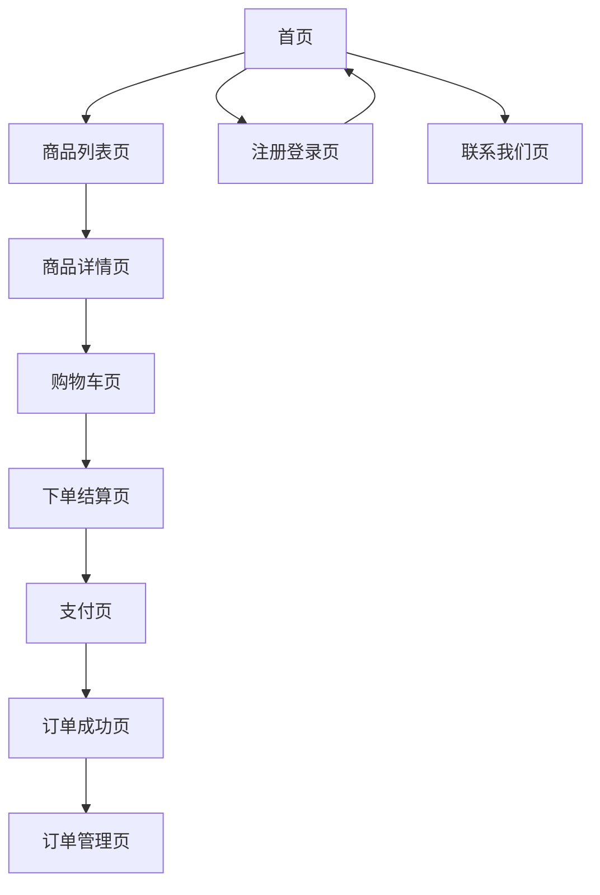

## 1. Product Overview
打造面向中国消费者的现代女装电商网站，提供简洁优雅的购物体验。网站专注于快时尚女装销售，参考Zara和H&M的设计理念，为追求时尚的中国女性提供便捷的在线购物平台。

目标用户为18-35岁的中国女性消费者，通过移动端和桌面端提供无缝的购物体验，满足现代女性对时尚、品质和便利性的需求。

## 2. Core Features

### 2.1 User Roles
| Role | Registration Method | Core Permissions |
|------|---------------------|------------------|
| 普通用户 | 邮箱、微信、支付宝注册 | 浏览商品、下单购买、查看订单、评价商品 |
| VIP用户 | 累计消费满一定金额自动升级 | 享受专属折扣、优先客服、生日礼品 |

### 2.2 Feature Module
网站核心功能包含以下主要页面：
1. **首页**：轮播图展示、新品推荐、热销商品、新用户弹窗
2. **注册登录页**：邮箱注册、微信登录、支付宝登录
3. **商品列表页**：商品筛选、分类浏览、搜索功能
4. **商品详情页**：商品图片展示、尺码信息、用户评价、加入购物车
5. **购物车页**：商品管理、数量调整、价格计算
6. **下单结算页**：收货地址填写、支付方式选择、订单确认
7. **支付页**：支付宝、微信支付、银行卡支付
8. **订单管理页**：历史订单查看、订单状态跟踪
9. **联系我们页**：邮件联系方式、客服信息

### 2.3 Page Details
| Page Name | Module Name | Feature description |
|-----------|-------------|---------------------|
| 首页 | 轮播图模块 | 自动轮播品牌宣传图，支持手动切换，展示最新活动和季节新品 |
| 首页 | 新品推荐 | 展示最新上架的女装商品，按上架时间排序，支持快速浏览 |
| 首页 | 热销商品 | 展示销量最高的商品，帮助用户发现热门款式 |
| 首页 | 新用户弹窗 | 首次访问用户显示欢迎弹窗，提供优惠券和购物指南 |
| 注册登录页 | 邮箱注册 | 输入邮箱、密码、手机号完成注册，发送验证邮件 |
| 注册登录页 | 第三方登录 | 支持微信、支付宝快捷登录，简化注册流程 |
| 商品列表页 | 商品筛选 | 按价格、尺码、颜色、款式等条件筛选商品 |
| 商品列表页 | 分类浏览 | 按上衣、裙装、裤装、外套等分类展示商品 |
| 商品列表页 | 搜索功能 | 支持关键词搜索，实时显示搜索结果 |
| 商品详情页 | 图片展示 | 高清大图展示商品，支持放大查看细节 |
| 商品详情页 | 尺码信息 | 详细尺码表，帮助用户选择合适尺码 |
| 商品详情页 | 用户评价 | 展示购买用户真实评价和晒图 |
| 商品详情页 | 购物车操作 | 选择尺码、颜色后加入购物车 |
| 购物车页 | 商品管理 | 查看已选商品，修改购买数量，删除商品 |
| 购物车页 | 价格计算 | 自动计算商品总价，显示优惠信息 |
| 下单结算页 | 地址填写 | 填写收货地址，支持地址簿管理 |
| 下单结算页 | 支付方式 | 选择支付宝、微信或银行卡支付 |
| 下单结算页 | 订单确认 | 确认商品信息、收货地址、支付金额 |
| 支付页 | 多渠道支付 | 集成支付宝、微信支付、银行卡支付接口 |
| 订单管理页 | 历史订单 | 查看所有历史订单，按时间排序 |
| 订单管理页 | 状态跟踪 | 实时显示订单状态，物流信息查询 |
| 联系我们页 | 邮件联系 | 提供客服邮箱，支持用户邮件咨询 |

## 3. Core Process

### 用户购物流程
用户从首页浏览商品，通过商品列表页筛选心仪商品，进入商品详情页查看详细信息，选择尺码颜色后加入购物车。在购物车中确认商品信息，进入结算页面填写收货地址并选择支付方式，完成支付后生成订单，可在订单管理页查看订单状态和物流信息。

### 新用户注册流程
新用户首次访问网站时显示欢迎弹窗，引导用户注册。用户可选择邮箱注册或第三方登录，注册成功后自动登录并跳转到首页，可立即开始购物。

## 4. User Interface Design

### 4.1 Design Style
- **主色调**：纯黑色(#000000)、纯白色(#FFFFFF)、中灰色(#666666)
- **点缀色**：柔和米色(#F5E6D3)、深蓝色(#1E3A8A)
- **按钮样式**：简洁的矩形设计，悬停时有轻微阴影效果
- **字体**：中文使用思源黑体，英文使用Helvetica，正文字号14-16px
- **布局风格**：卡片式布局，大量留白，突出商品图片
- **图标风格**：使用线条简洁的线性图标，保持视觉统一性

### 4.2 Page Design Overview
| Page Name | Module Name | UI Elements |
|-----------|-------------|-------------|
| 首页 | 轮播图 | 全屏宽度，高度500px，自动切换间隔3秒，底部指示器 |
| 首页 | 商品展示 | 网格布局，每行4个商品卡片，卡片间距20px，图片占比70% |
| 注册登录页 | 登录表单 | 居中布局，宽度400px，输入框高度45px，圆角5px |
| 商品列表页 | 筛选栏 | 顶部固定，高度60px，分类按钮横向排列 |
| 商品详情页 | 图片展示 | 左侧大图，宽度60%，支持放大镜功能查看细节 |
| 购物车页 | 商品列表 | 卡片式设计，每个商品一行，显示缩略图和基本信息 |
| 结算页 | 地址表单 | 分组显示地址信息，支持新增和选择已有地址 |

### 4.3 Responsiveness
- **设计理念**：移动端优先设计，确保在小屏幕上最佳体验
- **断点设置**：手机(<768px)、平板(768-1024px)、桌面(>1024px)
- **移动端适配**：
  - 首页轮播图高度调整为300px
  - 商品网格从4列变为2列
  - 底部固定导航栏，包含首页、分类、购物车、个人中心
  - 触摸手势支持，左右滑动切换商品图片
- **性能优化**：图片懒加载，压缩图片大小，提升加载速度