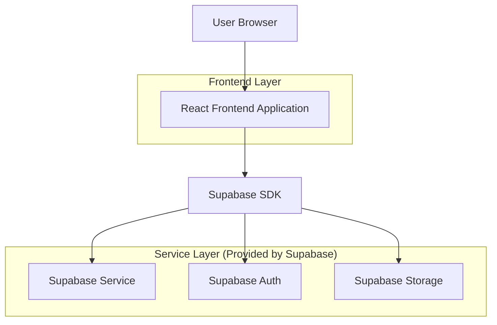
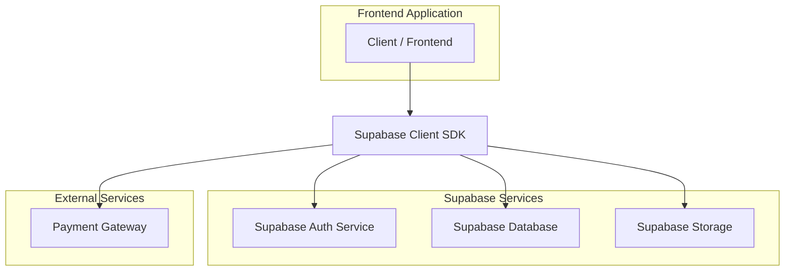
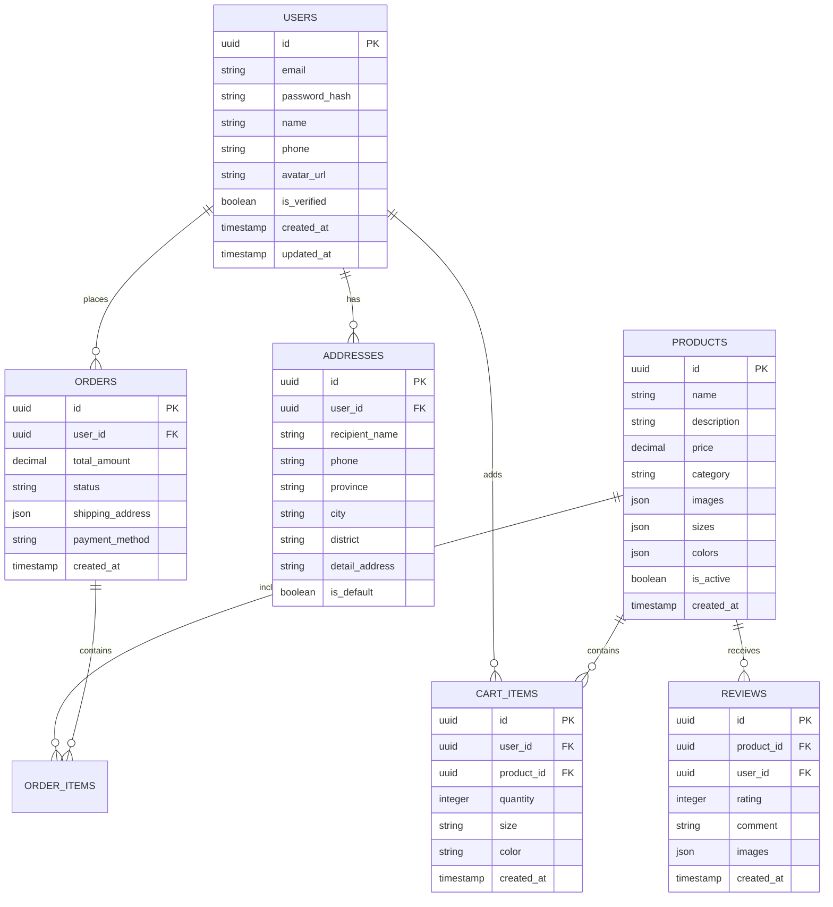

## 1. Architecture design



## 2. Technology Description

* Frontend: React\@18 + tailwindcss\@3 + vite

* Initialization Tool: vite-init

* Backend: Supabase (BaaS)

* Database: Supabase PostgreSQL

* Authentication: Supabase Auth

* File Storage: Supabase Storage

* Payment Integration: 支付宝/微信支付 SDK

## 3. Route definitions

| Route          | Purpose             |
| -------------- | ------------------- |
| /              | 首页，展示轮播图、新品推荐、热销商品  |
| /auth/login    | 登录页面，支持邮箱和第三方登录     |
| /auth/register | 注册页面，邮箱注册和第三方注册     |
| /products      | 商品列表页，展示所有商品和筛选功能   |
| /products/:id  | 商品详情页，展示商品详细信息和用户评价 |
| /cart          | 购物车页面，管理已选商品        |
| /checkout      | 结算页面，填写收货地址和选择支付方式  |
| /payment       | 支付页面，集成多种支付方式       |
| /orders        | 订单管理页面，查看历史订单       |
| /profile       | 个人中心，用户信息和设置        |
| /contact       | 联系我们页面，提供客服联系方式     |

## 4. API definitions

### 4.1 Core API

商品列表获取

```
GET /api/products
```

请求参数:

| Param Name | Param Type | isRequired | Description |
| ---------- | ---------- | ---------- | ----------- |
| category   | string     | false      | 商品分类        |
| page       | number     | false      | 页码          |
| limit      | number     | false      | 每页数量        |
| sort       | string     | false      | 排序方式        |

响应:

| Param Name | Param Type | Description |
| ---------- | ---------- | ----------- |
| products   | array      | 商品列表        |
| total      | number     | 总商品数        |
| hasMore    | boolean    | 是否还有更多      |

用户认证相关

```
POST /api/auth/login
```

请求:

| Param Name | Param Type | isRequired | Description |
| ---------- | ---------- | ---------- | ----------- |
| email      | string     | true       | 用户邮箱        |
| password   | string     | true       | 密码          |

响应:

| Param Name | Param Type | Description |
| ---------- | ---------- | ----------- |
| user       | object     | 用户信息        |
| token      | string     | 访问令牌        |

购物车操作

```
POST /api/cart/add
```

请求:

| Param Name | Param Type | isRequired | Description |
| ---------- | ---------- | ---------- | ----------- |
| productId  | string     | true       | 商品ID        |
| quantity   | number     | true       | 数量          |
| size       | string     | true       | 尺码          |
| color      | string     | true       | 颜色          |

订单创建

```
POST /api/orders/create
```

请求:

| Param Name    | Param Type | isRequired | Description |
| ------------- | ---------- | ---------- | ----------- |
| items         | array      | true       | 订单商品        |
| address       | object     | true       | 收货地址        |
| paymentMethod | string     | true       | 支付方式        |

## 5. Server architecture diagram



## 6. Data model

### 6.1 Data model definition



### 6.2 Data Definition Language

用户表 (users)

```sql
-- create table
CREATE TABLE users (
  id UUID PRIMARY KEY DEFAULT gen_random_uuid(),
  email VARCHAR(255) UNIQUE NOT NULL,
  password_hash VARCHAR(255) NOT NULL,
  name VARCHAR(100) NOT NULL,
  phone VARCHAR(20),
  avatar_url TEXT,
  is_verified BOOLEAN DEFAULT FALSE,
  role VARCHAR(20) DEFAULT 'user' CHECK (role IN ('user', 'vip')),
  created_at TIMESTAMP WITH TIME ZONE DEFAULT NOW(),
  updated_at TIMESTAMP WITH TIME ZONE DEFAULT NOW()
);

-- create index
CREATE INDEX idx_users_email ON users(email);
CREATE INDEX idx_users_created_at ON users(created_at DESC);

-- grant permissions
GRANT SELECT ON users TO anon;
GRANT ALL PRIVILEGES ON users TO authenticated;
```

商品表 (products)

```sql
-- create table
CREATE TABLE products (
  id UUID PRIMARY KEY DEFAULT gen_random_uuid(),
  name VARCHAR(200) NOT NULL,
  description TEXT,
  price DECIMAL(10,2) NOT NULL,
  category VARCHAR(50) NOT NULL,
  images JSONB DEFAULT '[]',
  sizes JSONB DEFAULT '[]',
  colors JSONB DEFAULT '[]',
  stock_quantity INTEGER DEFAULT 0,
  is_active BOOLEAN DEFAULT TRUE,
  created_at TIMESTAMP WITH TIME ZONE DEFAULT NOW(),
  updated_at TIMESTAMP WITH TIME ZONE DEFAULT NOW()
);

-- create index
CREATE INDEX idx_products_category ON products(category);
CREATE INDEX idx_products_price ON products(price);
CREATE INDEX idx_products_is_active ON products(is_active);
CREATE INDEX idx_products_created_at ON products(created_at DESC);

-- grant permissions
GRANT SELECT ON products TO anon;
GRANT ALL PRIVILEGES ON products TO authenticated;
```

订单表 (orders)

```sql
-- create table
CREATE TABLE orders (
  id UUID PRIMARY KEY DEFAULT gen_random_uuid(),
  user_id UUID REFERENCES users(id) ON DELETE CASCADE,
  total_amount DECIMAL(10,2) NOT NULL,
  status VARCHAR(50) DEFAULT 'pending' CHECK (status IN ('pending', 'paid', 'shipped', 'delivered', 'cancelled')),
  shipping_address JSONB NOT NULL,
  payment_method VARCHAR(50) NOT NULL,
  payment_status VARCHAR(50) DEFAULT 'pending',
  created_at TIMESTAMP WITH TIME ZONE DEFAULT NOW(),
  updated_at TIMESTAMP WITH TIME ZONE DEFAULT NOW()
);

-- create index
CREATE INDEX idx_orders_user_id ON orders(user_id);
CREATE INDEX idx_orders_status ON orders(status);
CREATE INDEX idx_orders_created_at ON orders(created_at DESC);

-- grant permissions
GRANT SELECT ON orders TO authenticated;
GRANT ALL PRIVILEGES ON orders TO authenticated;
```

购物车表 (cart\_items)

```sql
-- create table
CREATE TABLE cart_items (
  id UUID PRIMARY KEY DEFAULT gen_random_uuid(),
  user_id UUID REFERENCES users(id) ON DELETE CASCADE,
  product_id UUID REFERENCES products(id) ON DELETE CASCADE,
  quantity INTEGER NOT NULL CHECK (quantity > 0),
  size VARCHAR(10),
  color VARCHAR(50),
  created_at TIMESTAMP WITH TIME ZONE DEFAULT NOW(),
  updated_at TIMESTAMP WITH TIME ZONE DEFAULT NOW(),
  UNIQUE(user_id, product_id, size, color)
);

-- create index
CREATE INDEX idx_cart_items_user_id ON cart_items(user_id);
CREATE INDEX idx_cart_items_product_id ON cart_items(product_id);

-- grant permissions
GRANT SELECT ON cart_items TO authenticated;
GRANT ALL PRIVILEGES ON cart_items TO authenticated;
```

评价表 (reviews)

```sql
-- create table
CREATE TABLE reviews (
  id UUID PRIMARY KEY DEFAULT gen_random_uuid(),
  product_id UUID REFERENCES products(id) ON DELETE CASCADE,
  user_id UUID REFERENCES users(id) ON DELETE CASCADE,
  rating INTEGER NOT NULL CHECK (rating >= 1 AND rating <= 5),
  comment TEXT,
  images JSONB DEFAULT '[]',
  created_at TIMESTAMP WITH TIME ZONE DEFAULT NOW(),
  UNIQUE(product_id, user_id)
);

-- create index
CREATE INDEX idx_reviews_product_id ON reviews(product_id);
CREATE INDEX idx_reviews_user_id ON reviews(user_id);
CREATE INDEX idx_reviews_rating ON reviews(rating);

-- grant permissions
GRANT SELECT ON reviews TO anon;
GRANT ALL PRIVILEGES ON reviews TO authenticated;
```

